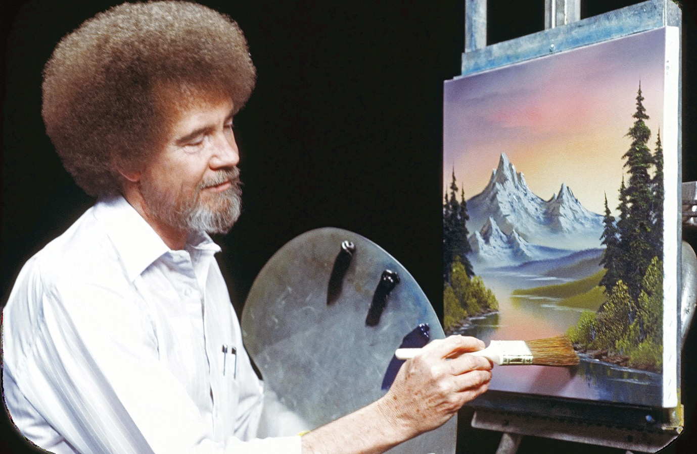

In the previous article, I touched a little bit about cohesion and how one may come to learn about it, specifically in [CS](https://en.wikipedia.org/wiki/Computer_science) or generic system design. Let me reiterate: [cohesion](<https://en.wikipedia.org/wiki/Cohesion_(computer_science)>) - is the degree to which the elements inside a module (or a function, or a class, an object, component, etc.) _belong together_. Cohesion is usually described as high or low and is often associated and contrasted with [coupling](<https://en.wikipedia.org/wiki/Coupling_(computer_programming)>), which is the degree of _interdependence between modules_.

High cohesion is always preferable and is related to higher understandability, reliability, and reusability of your module. High (tight) coupling, on the other hand, is something that you would want to avoid because that would mean your modules are so interconnected and interdependent it is very hard to distinguish between them, hard to understand what is going on with them, hard to reuse.

Tight coupling would often mean low cohesion and vise versa, but... not necessarily.

---

Cohesion is an odd topic because it is very much fundamental and you might stumble on it very early on in CS. **But in practice, you will never speak about it ever again**. In business when given a task to design anything, you might get additional technical restrictions like:

- make sure a component is reusable
- make sure it is small enough and understandable
- make sure it only does one thing
- make sure a component does not implicitly rely on any other component via inheritance or otherwise
- make sure its API is simple, explicit and straight-forward
- basically, make sure it is somewhat [SOLID](https://en.wikipedia.org/wiki/SOLID)

All of those are aspects of cohesion, but _nobody ever_ will even note that. We are always trying to design cohesive systems, but we never speak about this as a requirement, we never look at the bigger picture in a particular sense. Which seems kind of ironic because cohesion is a systemic thing - it is always there no matter what.

Cohesion is unwieldy. It is a huge abstract system-wide thing that affects everything, which makes it very hard to think about. Cohesion is inherently subjective, even though there are [some objective sides to it](<https://en.wikipedia.org/wiki/Cohesion_(computer_science)#Types_of_cohesion>), and depends on a subject's expectations about a particular system. Cohesion might look like less of a problem of system design and more like a state of an already designed system, which in a problem-solving driven world makes it not worthy of attention.

Instead of trying to solve a system-wide flaw, we are busy with its symptoms, fixing one aspect at a time. And sometimes it works, - you know, we only have so much time, money, and experience, - but other times it introduces repeated cycles of fixes which introduce other bugs, which you fix and reopen previous bugs again, which you try to fix one more time, which pops even more bugs than before, and it just goes on, and on, and on, until you finally solve this mess, or it breaks you.

> Working in isolation is cool and all, but to see how components fit together you will have to shift your focus and make a step back.

## Bob Ross and a cohesive picture

Before I start jumping to metaphors about Legos, bricks, and walls, talking about what is a component and what makes it cohesive, and what makes it fit into an already existing system, I feel like it is actually easier and more productive to move away from CS entirely and look at cohesion in a completely different area. Specifically, let us look at art, pictures to be exact.

Here, meet one and only, [Bob Ross](https://en.wikipedia.org/wiki/Bob_Ross). Ross is sort of a modern legend nowadays, he became famous with his TV show [The Joy of Painting](https://en.wikipedia.org/wiki/The_Joy_of_Painting), wherein each episode, in a ~30 minutes span, he taught people how to make beautiful paintings _effortlessly_.

The pitch of the show was - **you can do it**. And the key to his method seems to be in building painting in layers from back to the foreground, placing effects and entities on top of each other, blending them a little over and over again to make them fit better.

Basically, he starts every painting by filling in the innermost layer of a painting: basic shades of a sky and a sea. Then, on top of it, he places some basic clouds and blends them. Depending on how hard he blends a cloud - it may appear further or closer to the viewer. Then, he paints other more pronounced clouds on top, again blending them here and there, but much less so, than the previous ones, so they would have more detail in them and appear even more closely to the viewer.

    

By layering clouds in such a way on top of each other he creates _an illusion of depth_, which makes paintings more impressive and more believable. It also allows him to have more control over shading (shadows & light), because it is much more likely for entities on the front to drop their shadows on the background than the other way around.

    

In such a manner Ross continues to paint an entire painting: moving from clouds to mountains, covering mountains with rocks, moss and trees, covering head of the mountain with even more clouds, covering its foot with some basic forest, layering forest forward to the middle ground, placing a river, covering a river with more detailed trees, covering trees with grass and bushes, and so on, and so on, until a picture is finally done.

    

This method of picturing stuff from back to front is not exclusive to composing a painting, but is also applied to its every individual component as well. Bob paints a mountain? He goes back to front: from basic shades, to light and shadow zones, to tinting, to details. He paints some trees? Well, back to front again: from basic shades, to trunk color and base color, to accent/highlight color, to details, to coverings.

> So what's about cohesion?

If you look at his videos close enough (there're a lot on youtube; check out [this one](https://youtu.be/RInDWhYceLU) for example), you'll notice how the feel of a painting drastically changes from time to time, like when he stops painting a sky and a sea and starts painting a mountain over them. At first, a mountain is just a dark pyramid shape and looks very out of place. But as he starts to add more detail to it, blend it here and there, it starts to fit and feel more natural. And it blends into the picture completely, when even more stuff is layered on top of it, like forests, wind effects, other lesser mountains and so on.

This is really what cohesion feels and looks like - it's when every component fits into its layer, and when every layer fits into a grander composition.

## What’s next?

In the next part of this article, we'll try to compare the cohesion of art with the cohesion of CS-system-design and see if it really is the very same thing.